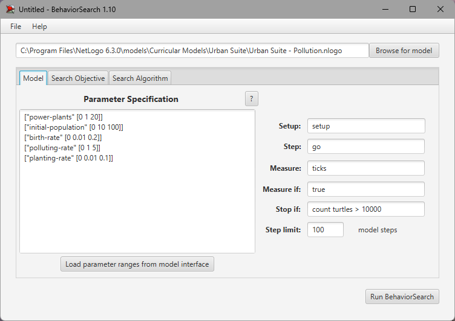
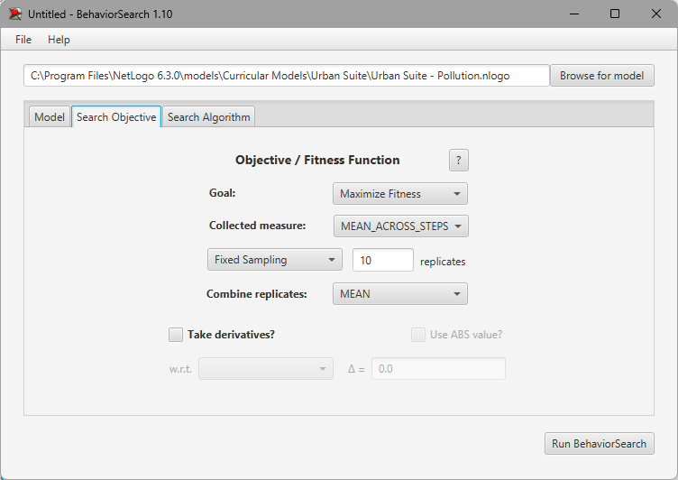
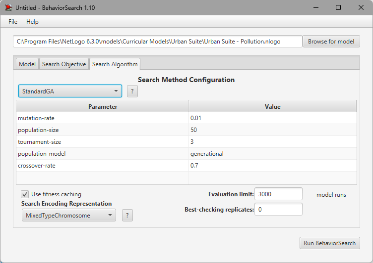
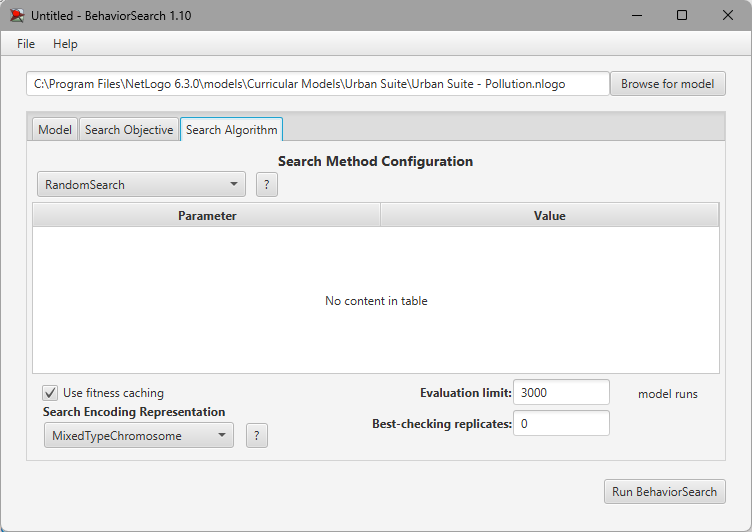
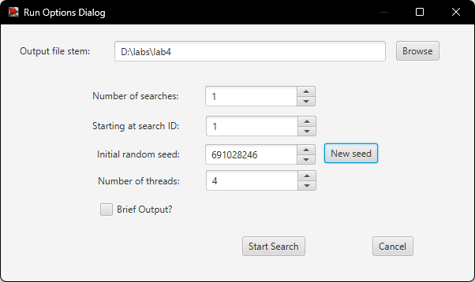
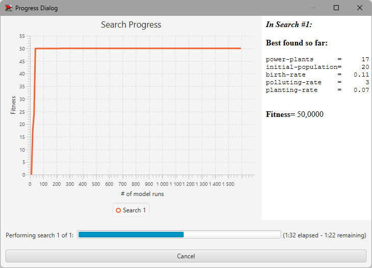
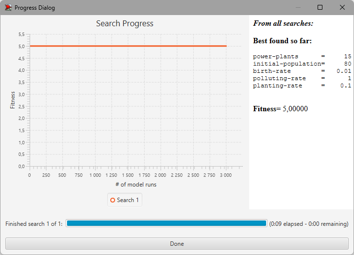

# lab3
# СПм-22-6, Бохан Іван Анатолійович
### Лабораторна робота №**3**. Використання засобів обчислювального интелекту для оптимізації імітаційних моделей

 

### Варіант 4, модель у середовищі NetLogo:
[Urban Suite - Pollution](http://www.netlogoweb.org/launch#http://www.netlogoweb.org/assets/modelslib/Curricular%20Models/Urban%20Suite/Urban%20Suite%20-%20Pollution.nlogo)

 

### Вербальний опис моделі:
Для виконання завдання лабораторної роботи я використовую модель Urban Suite - Pollution. Ця модель є дослідженням крихкої рівноваги екосистеми хижак-жертва. Популяції людей, елементів ландшафту та зграї повітряних забруднювачів конкурують за ресурси в замкнутому середовищі. Використовуючи цю модель, можна досліджувати поведінку популяцій протягом тривалого часу, коли вони динамічно взаємодіють: хижаків (забруднення) і здобич (людей) можна порівнювати протягом кількох поколінь, оскільки їхні популяції демонструють регулярний або нерегулярний репродуктивний успіх.
Регулярні коливання (цикли) чисельності популяції вказують на баланс і стабільність в екосистемі, де, незважаючи на коливання, популяції зберігаються протягом тривалого часу. І навпаки, нерегулярні коливання вказують на нестабільність, що веде до потенційного вимирання обох співзалежних популяцій. Модель встановлює негативну петлю зворотного зв’язку: хижаки гальмують щільність здобичі, а здобич стимулює щільність хижаків.
### Як працює модель:
Електростанції створюють забруднення, яке поширюється в навколишнє середовище. Здоров’я людей, які піддаються впливу цього забруднення, негативно впливає, зменшуючи їхні шанси на відтворення. Ті, хто здатні відтворювати потомство, створять здорових дітей при певній народжуваності. Люди також можуть вжити певних дій, щоб полегшити проблему забруднення, яка представлена в цій моделі шляхом висаджування дерев. Наявність дерев допомагає стримувати забруднення.

Навіть без забруднення здоров’я людей з часом погіршується, і вони врешті-решт помруть природною смертю. Щоб дозволити популяціям людей вистояти, людей клонують з певною швидкістю (див. повзунок НАРОДЖУВАННЯ). Стабільність екосистеми досягається, якщо рівні забруднюючих речовин утримуються під контролем, і ні популяції людей, ні елементи ландшафту не обганяють навколишнє середовище. Як і в будь-якому моделюванні на основі агентів, правила визначають поведінку кожного окремого агента в кожній сукупності.

### Параметри Setup:
- **initial-population** - контролює кількість людей, створених на початку запуску моделі.
- **power-plants** - контролює кількість створених на старті симуляції електростанцій.
- **polluting-rate** - це забруднення, яке виробляє кожна електростанція за рік. Потім це забруднення поширюється на навколишню територію.

### Параметри, що можуть надавати вплив під час роботи симуляції:
- **birth-rate** - контролює можливість кожної людини народити потомство. Початкова ставка 0,10 означає, що кожен рік вони мають 10% шансів мати дитину, якщо вони достатньо здорові. Люди повинні мати 4 бали здоров'я або більше, щоб відтворювати потомство, і вони втрачають 0,1 бали щороку. Це означає, що вони мають щонайбільше 10 років для розмноження, і навіть менше, якщо вони постраждали від забруднення. Параметр за замовчуванням дуже близький до "коефіцієнта заміщення", що означає, що в середньому кожна людина має одне потомство.
- **planting-rate** - контролює зміну, яку людина має висаджувати дерево щороку. Значення за замовчуванням 0,05 означає, що вони мають 5% шанс. Дерева живуть 50 років і ніколи не розмножуються. У цьому сенсі вони не є буквально деревами, а представляють будь-який механізм очищення забруднення.

### Показники роботи системи:
- count people - поточна кількість людей.
- World Status - графік показує, скільки там дерев, скільки людей і скільки забруднень, що відображається в часі під час роботи моделі.

### Налаштування середовища BehaviorSearch:

**Обрана модель**:
<pre>
C:\Program Files\NetLogo 6.3.0\models\Curricular Models\Urban Suite\Urban Suite - Pollution.nlogo
</pre>
**Параметри моделі** (вкладка Model):  
*Параметри та їх модливі діапазони були **автоматично** вилучені середовищем BehaviorSearch із вибраної імітаційної моделі, для цього є кнопка «Завантажити діапазони параметрів із інтерфейсу моделі»*:
<pre>
["power-plants" [0 1 20]]
["initial-population" [0 10 100]]
["birth-rate" [0 0.01 0.2]]
["polluting-rate" [0 1 5]]
["planting-rate" [0 0.01 0.1]]
</pre>
Використовувана **міра**:  
Для фітнес-функції *(вона ж функція пристосованості або цільова функція)* було обрано **Кількість прожитих років**. Через те, що параметр **years**, що відображає загальну кількість років, прожиту популяцією, пов'язаний напряму з кількістю тактів(ticks), було вирішено у параметр **Measure** записати наступне:
<pre>
ticks
</pre>
Кількість років життя популяції повинна враховуватися за весь період симуляції тривалістю 3000 тактів, починаючи з 0 такту симуляції.  
*Параметр "**Mesure if**" зі значення true, по суті, і означає, що враховуватимуться всі такти симуляції, а чи не частина їх. Іноді має сенс не враховувати деякі такти через хаос в деяких моделях на початку їх використання. Наприклад, це показано в прикладі з документації BehaviorSearch.  
Параметри "**Setup**" та "**Go**" вказують відповідні процедури ініціалізації та запуску в логіці моделі (зазвичай вони так і називаються). BehaviorSearch в процесі роботи, по суті, замість користувача запускає ці процедури.*  
Параметр зупинки за умовою ("**Stop if**") використовувався таким чином, щоб уникнути занадто високих навантажень на ЕОМ:
<pre>
count turtles > 10000
</pre>
Загальний вигляд вкладки налаштувань параметрів моделі:  

**Налаштування цільової функції** (вкладка Search Objective):  
Метою підбору параметрів імітаційної моделі є **максимізація** значення прожитих років – це вказано через параметр "**Goal**" зі значенням **Maximize Fitness**. Тобто необхідно визначити такі параметри налаштувань моделі, у яких люди у процесі життя, розмноження та посадки дерев покращують атмосферу та відповідно кількість прожитих років окремої людини, а відповідной наданий їй час для розмноження та висадки нових дерев. Параметр "**Collected measure**", що визначає спосіб обліку значень обраного показника, вказано **MEAN_ACROSS_STEPS**.  
Щоб уникнути викривлення результатів через випадкові значення, що використовуються в логіці самої імітаційної моделі, **кожна симуляція повторюється по 10 разів**, результуюче значення розраховується як **середнє арифметичне**. 
Загальний вигляд вкладки налаштувань цільової функції:  

**Налаштування алгоритму пошуку** (вкладка Search Algorithm):  
Загальний вид вкладки налаштувань алгоритму пошуку для Генетичного алгоритму:  

Загальний вид вкладки налаштувань алгоритму пошуку для випадкового пошуку:

 

### Результати використання BehaviorSearch:
Діалогове вікно запуску пошуку:  

Результат пошуку параметрів імітаційної моделі, використовуючи **генетичний алгоритм**:  

Результат пошуку параметрів імітаційної моделі, використовуючи **випадковий пошук**:  

Як можна побачити - для випадкового пошуку знадобилося менше часу, але значення фітнес-функції набагато менше.
